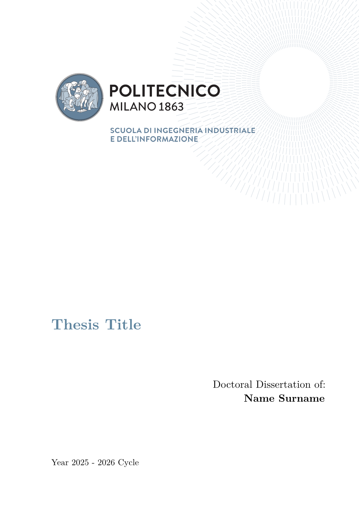

# elegant-polimi-thesis 🎓

[Typst](https://typst.app/) thesis template for the [Polytechnic University of Milan](https://www.polimi.it/). Its design has been based on the templates that can be found on [this page](https://www.overleaf.com/latex/templates/tagged/polimi).

See the [examples](examples/) directory and [documentation](docs/docs.pdf) for more information.

## Preview ✨

<p align="center">
  
</p>

## Usage 🖋

You can either use this template in the webapp by clicking on "Create project in webapp" or, from the CLI, run:

```shell
typst init @preview/elegant-polimi-thesis:0.1.2
```

I'd also recommend to use the `--pdf-standard a-3u` flag ([see more](https://typst.app/docs/reference/pdf/#pdf-standards)).

To get started:

```typ
#import "@preview/elegant-polimi-thesis:0.1.2": *

#show: polimi-thesis.with(
  title: "Thesis Title",
  author: "Vittorio Robecchi",
  advisor: "Prof. Donatella Sciuto",
  coadvisor: "Prof. Antonio Capone",
  tutor: "Prof. Marco Bramanti",
  colored-headings: true
)

#show: frontmatter

// abstract in English

// sommario in Italian

#show: acknowledgements

// acknowledgements

#toc
#list-of-figures
#list-of-tables

#let nomenclature_ = (
  "key" : "value"
)
#nomenclature(
  nomenclature_,
  indented: true
)

#show: mainmatter

// main section of the thesis

#show: backmatter

// backmatter

#show: appendix

// appendix

#show: backmatter

// bibliography

#show: acknowledgements

// acknowlegements
```

The full list of options is as follows:

- `title`: title of the thesis
- `author`: name and surname of the author
- `advisor`: name and surname of the advisor
- `coadvisor`: name and surname of the coadvisor(s) (can be empty)
- `tutor`: name and surname of the tutor
- `academic-year`: the corresponding academic year
- `cycle`: the cycle of the thesis
- `language`: language of the thesis (default: `en`; other supported: `it`)
- `colored-headings`: whether to use colored headings, captions or not
- `main-logo`: logo of the thesis

See the `docs/` folder for a thorough example on how to style the thesis.

## Recommended packages

Useful packages for a thesis include:

- [equate](https://typst.app/universe/package/equate), [physica](https://typst.app/universe/package/physica) for mathematical expressions
- [unify](https://typst.app/universe/package/unify), [zero](https://typst.app/universe/package/zero) to correctly format numbers
- [cetz](https://typst.app/universe/package/cetz), [fletcher](https://typst.app/universe/package/fletcher) for drawing diagrams, [lilaq](https://typst.app/universe/package/lilaq) to plot data
- [zebraw](https://typst.app/universe/package/zebraw), [codly](https://typst.app/universe/package/codly) for syntax highlighting in code blocks
- [frame-it](https://typst.app/universe/package/frame-it), [showybox](https://typst.app/universe/package/showybox) to display formatted blocks
- [alexandria](https://typst.app/universe/package/alexandria) for multiple bibliographies ([currently unsupported](https://github.com/typst/typst/issues/1097))

The [smartaref](https://typst.app/universe/package/smartaref) and [hallon](https://typst.app/universe/package/hallon) packages have been integrated to provide subfigures ([currently unsupported](https://github.com/typst/typst/issues/246)), while [great-theorems](https://typst.app/universe/package/great-theorems) and [headcount](https://typst.app/universe/package/headcount) to handle theorems implementations.

|                      Typst package                      |             LaTeX equivalent              |
| :-----------------------------------------------------: | :---------------------------------------: |
|   [equate](https://typst.app/universe/package/equate)   |             ams\*, mathtools              |
|  [phisica](https://typst.app/universe/package/physica)  |             ams\*, mathtools              |
|    [unify](https://typst.app/universe/package/unify)    |  [siunitx](https://ctan.org/pkg/siunitx)  |
|     [zero](https://typst.app/universe/package/zero)     |  [siunitx](https://ctan.org/pkg/siunitx)  |
|     [cetz](https://typst.app/universe/package/cetz)     |         [TikZ](https://tikz.dev/)         |
| [fletcher](https://typst.app/universe/package/fletcher) |         [TikZ](https://tikz.dev/)         |
|    [lilaq](https://typst.app/universe/package/lilaq)    |         [TikZ](https://tikz.dev/)         |
|   [zebraw](https://typst.app/universe/package/zebraw)   | [listings](https://ctan.org/pkg/listings) |
|    [codly](https://typst.app/universe/package/codly)    | [listings](https://ctan.org/pkg/listings) |
| [frame-it](https://typst.app/universe/package/frame-it) | [mdframed](https://ctan.org/pkg/mdframed) |
| [showybox](https://typst.app/universe/package/showybox) | [mdframed](https://ctan.org/pkg/mdframed) |
| [lovelace](https://typst.app/universe/package/lovelace) |   [pseudo](https://ctan.org/pkg/pseudo)   |
|     [algo](https://typst.app/universe/package/algo)     |   [pseudo](https://ctan.org/pkg/pseudo)   |

The complete list of packages can be found on the [Typst Universe](https://typst.app/universe/search/?kind=packages).

# Contributing 🚀

If you happen to have suggestions, ideas or anything else feel free to open issues and pull requests or contact me.
