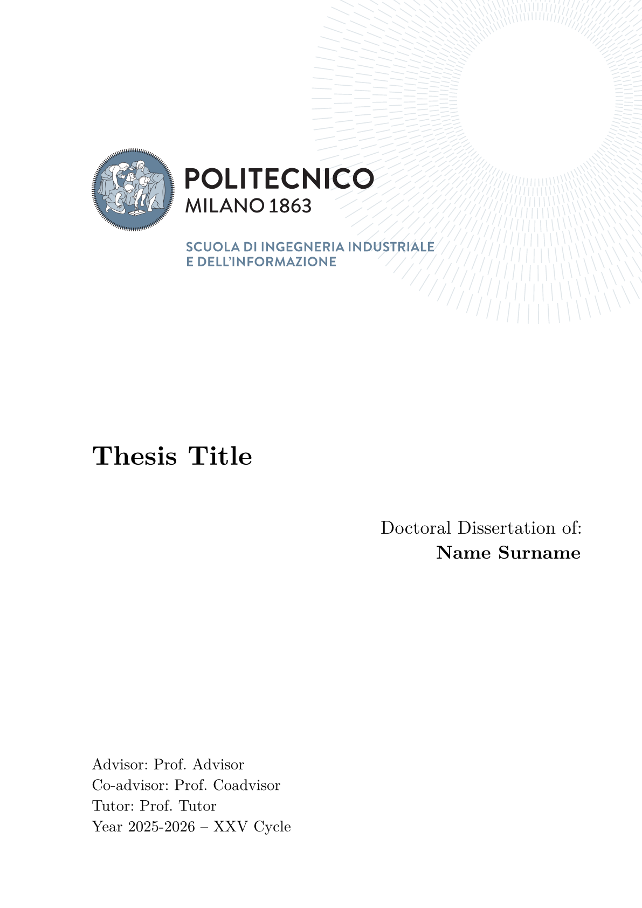
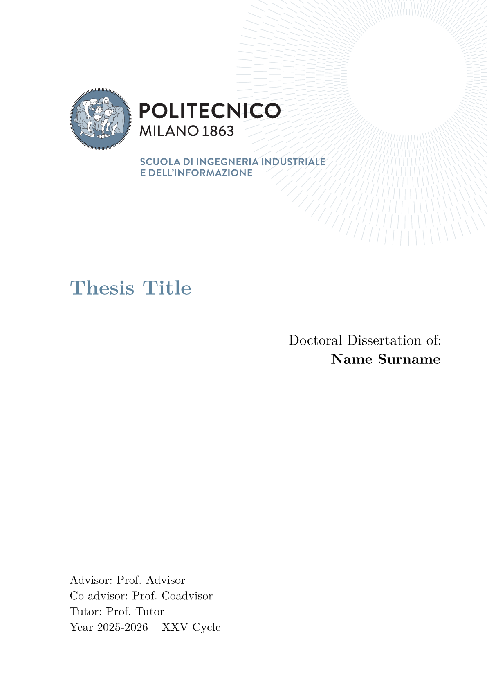
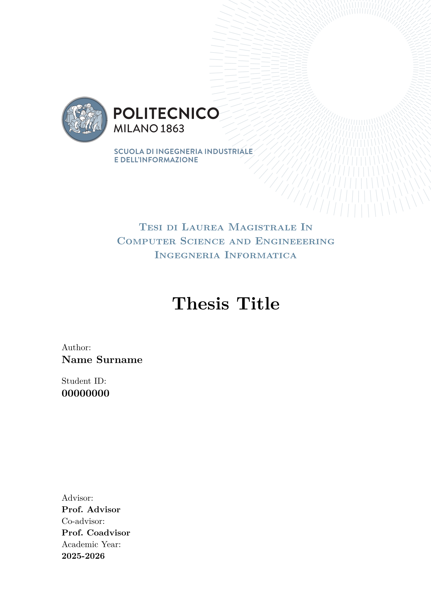
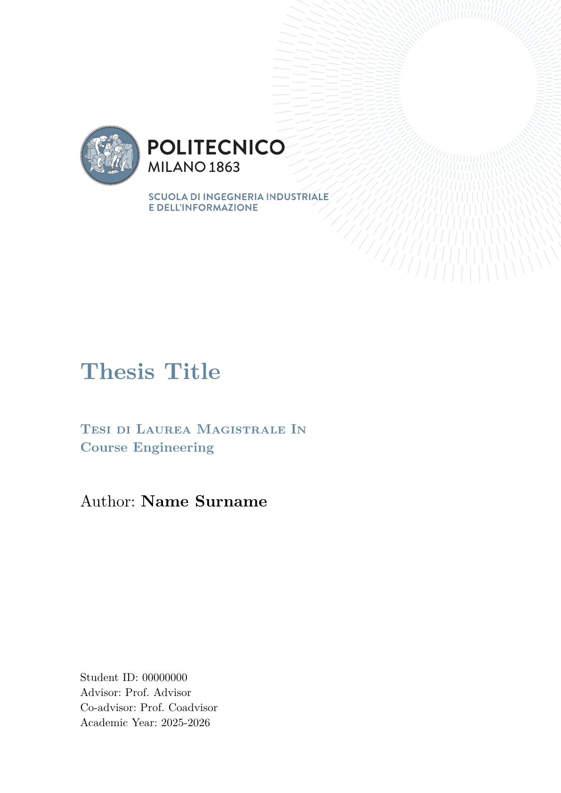
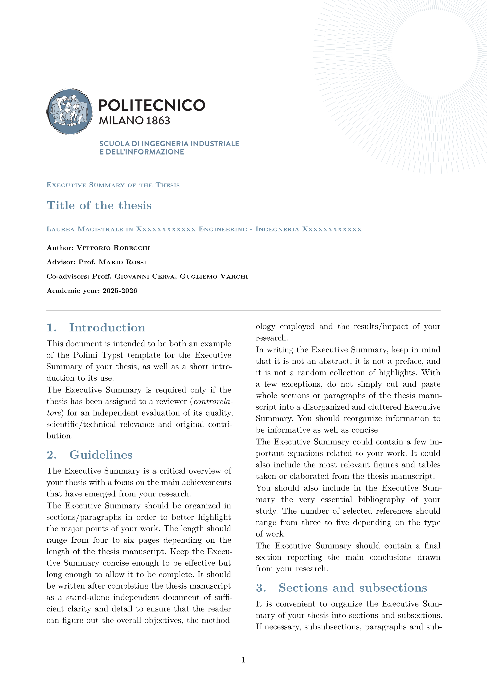
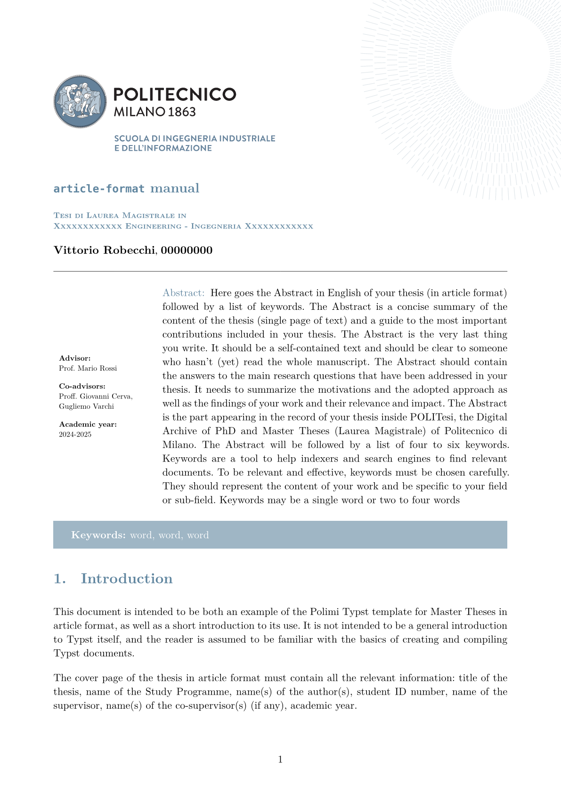

# elegant-polimi-thesis 🎓

[Typst](https://typst.app/) theses and summaries templates for the [Polytechnic University of Milan](https://www.polimi.it/). Although a single library, the project actually supports all the templates that can be found on [this page](https://www.overleaf.com/latex/templates/tagged/polimi).

See the [examples](examples/) directory and [documentation](docs/docs.pdf) for more information.

## Preview ✨

<table width=100% align="center">
  <tr>
    <td>
      
      <br />
      <div align="center"><em>PhD</em></div>
    </td>
    <td>
      
      <br />
      <div align="center"><em>DEIB PhD</em></div>
    </td>
  </tr>
  <tr>
    <td>
      
      <br>
      <div align="center"><em>Computer Science and Engineering</em></div>
    </td>
    <td>
      
      <br>
      <div align="center"><em>Classical Master</em></div>
    </td>
  </tr>
  <tr>
    <td>
      
      <br>
      <div align="center"><em>Executive Summary</em></div>
    </td>
    <td>
      
      <br>
      <div align="center"><em>Article Format</em></div>
    </td>
  <tr>
</table>

<!-- <table width=100% align="center">
  <tr>
    <td>
      
      <br />
      <div align="center"><em>PhD</em></div>
    </td>
    <td>
      
      <br />
      <div align="center"><em>DEIB PhD</em></div>
    </td>
    <td>
      
      <br>
      <div align="center"><em>Computer Science and Engineering</em></div>
    </td>
  </tr>
  <tr>
    <td>
      
      <br>
      <div align="center"><em>Classical Master</em></div>
    </td>
    <td>
      
      <br>
      <div align="center"><em>Executive Summary</em></div>
    </td>
    <td>
      
      <br>
      <div align="center"><em>Article Format</em></div>
    </td>
  <tr>
</table> -->

## Usage 🖋

You can either use this template in the webapp by clicking on "Create project in webapp" or, from the CLI, run:

```shell
typst init @preview/elegant-polimi-thesis:0.1.2
```

I'd also recommend to export with the `a-3u` PDF standard flag ([see more](https://typst.app/docs/reference/pdf/#pdf-standards)).

To get started:

```typ
#import "@preview/elegant-polimi-thesis:0.1.2": *

#show: polimi-thesis.with(
  title: "Thesis Title",
  author: "Vittorio Robecchi",
  advisor: "Donatella Sciuto",
  coadvisor: "Antonio Capone",
  tutor: "Marco Bramanti",
  frontispiece: "phd"
)

#show: frontmatter

// abstract in English

// sommario in Italian

#show: acknowledgements

// acknowledgements

#toc
#list-of-figures
#list-of-tables

#let nomenclature_ = (
  "key" : "value"
)
#nomenclature(
  nomenclature_,
  indented: true
)

#show: mainmatter

// main section of the thesis

#show: backmatter

// backmatter

#show: appendix

// appendix

#show: backmatter

// bibliography

#show: acknowledgements

// acknowlegements
```

Depending on the **thesis template** you need to use, change the `frontispiece` argument:

- `phd` for "PhD Thesis Template"
- `deib-phd` for "DEIB PhD Thesis"
- `classical-format` for "Classical Format Thesis"
- `cs-eng-master` for "Computer Science and Engineering"

The template also offers the Executive Summary and the Article Format; in order to use them show the respective functions:

```typ
#import "@preview/elegant-polimi-thesis:0.1.2": *

// For the article format
#show: polimi-article-format.with(
  title: "Thesis Title",
  author: "Vittorio Robecchi",
  advisor: "Prof. Donatella Sciuto",
  coadvisor: "Prof. Antonio Capone",
  abstract: include "../sections/abstract.typ"
)

// For the executive summary
#show: polimi-executive-summary.with(
  title: "Thesis Title",
  author: "Vittorio Robecchi",
  advisor: "Prof. Donatella Sciuto",
  coadvisor: "Prof. Antonio Capone",
)
```

The templates are **three distinct documents**, however they share _most_ of the arguments:

- `title`: title of the document
- `author`: name and surname of the author
- `advisor`: name and surname of the advisor
- `coadvisor`: name and surname of the coadvisor(s) (can be empty)
- `tutor`: name and surname of the tutor
- `academic-year`: the corresponding academic year
- `logo`: logo of the thesis

I recommend to import all the library anyway in order to access all the functions (`*matter`, theorems-related among others).

The following are exclusive to `polimi-thesis`:

- `tutor`: name and surname of the tutor
- `cycle`: the cycle of the thesis
- `chair`: the chair of the thesis
- `student-id`: your student ID
- `frontispiece`: the specific type of frontispiece to be used (default: `phd`; supported: `deib-phd`, `cs-eng-master` or `classical-master`)

Depending on the selected frontispiece, not all these attributes may be needed.

The following are exclusive to `polimi-article-format-thesis`:

- `abstract`: the abstract
- `keywords`: keywords (that will also appear in the document metadata)

Both the `polimi-article-format-thesis` and `polimi-executive-summary` share the `course` option.

## Recommended packages

Useful packages for a thesis include:

- [equate](https://typst.app/universe/package/equate), [physica](https://typst.app/universe/package/physica) for mathematical expressions
- [unify](https://typst.app/universe/package/unify), [zero](https://typst.app/universe/package/zero) to correctly format numbers
- [cetz](https://typst.app/universe/package/cetz), [fletcher](https://typst.app/universe/package/fletcher) for drawing diagrams, [lilaq](https://typst.app/universe/package/lilaq) to plot data
- [zebraw](https://typst.app/universe/package/zebraw), [codly](https://typst.app/universe/package/codly) for syntax highlighting in code blocks
- [frame-it](https://typst.app/universe/package/frame-it), [showybox](https://typst.app/universe/package/showybox) to display formatted blocks
- [alexandria](https://typst.app/universe/package/alexandria) for multiple bibliographies ([currently unsupported](https://github.com/typst/typst/issues/1097))
- [meander](https://typst.app/universe/package/meander/) to wrap text around images and such

The [smartaref](https://typst.app/universe/package/smartaref) and [hallon](https://typst.app/universe/package/hallon) packages have been integrated to provide subfigures ([currently unsupported](https://github.com/typst/typst/issues/246)), while [great-theorems](https://typst.app/universe/package/great-theorems) and [headcount](https://typst.app/universe/package/headcount) to handle theorems implementations.

|                      Typst package                      |             LaTeX equivalent              |
| :-----------------------------------------------------: | :---------------------------------------: |
|   [equate](https://typst.app/universe/package/equate)   |             ams\*, mathtools              |
|  [phisica](https://typst.app/universe/package/physica)  |             ams\*, mathtools              |
|    [unify](https://typst.app/universe/package/unify)    |  [siunitx](https://ctan.org/pkg/siunitx)  |
|     [zero](https://typst.app/universe/package/zero)     |  [siunitx](https://ctan.org/pkg/siunitx)  |
|     [cetz](https://typst.app/universe/package/cetz)     |         [TikZ](https://tikz.dev/)         |
| [fletcher](https://typst.app/universe/package/fletcher) |         [TikZ](https://tikz.dev/)         |
|    [lilaq](https://typst.app/universe/package/lilaq)    |         [TikZ](https://tikz.dev/)         |
|   [zebraw](https://typst.app/universe/package/zebraw)   | [listings](https://ctan.org/pkg/listings) |
|    [codly](https://typst.app/universe/package/codly)    | [listings](https://ctan.org/pkg/listings) |
| [frame-it](https://typst.app/universe/package/frame-it) | [mdframed](https://ctan.org/pkg/mdframed) |
| [showybox](https://typst.app/universe/package/showybox) | [mdframed](https://ctan.org/pkg/mdframed) |
| [lovelace](https://typst.app/universe/package/lovelace) |   [pseudo](https://ctan.org/pkg/pseudo)   |
|     [algo](https://typst.app/universe/package/algo)     |   [pseudo](https://ctan.org/pkg/pseudo)   |
| [meander](https://typst.app/universe/package/meander/)  |  [wrapfig](https://ctan.org/pkg/wrapfig)  |

The complete list of packages can be found on the [Typst Universe](https://typst.app/universe/search/?kind=packages).

# Roadmap 📝

- Support the [Digital presentation templates](https://drive.google.com/drive/folders/1PJUOglX63IjCMPYhZXAoPIVuH_-DmsPR?usp=drive_link)

# Contributing 🚀

If you happen to have suggestions, ideas or anything else feel free to open issues and pull requests or contact me.
